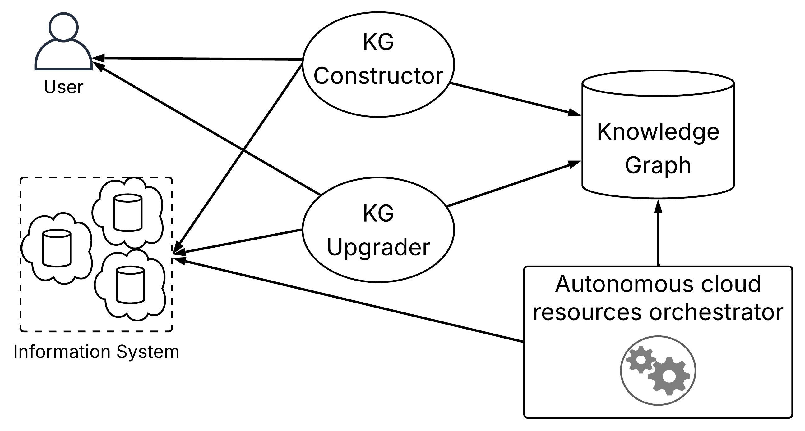

# Dynamic IT Knowledge Graph for Cloud-Native Environments

This project is the implementation of the approach described in the research paper "A Knowledge Graph Model for IT Infrastructure Mapping." It builds, maintains, and enriches a dynamic Knowledge Graph representing an IT infrastructure, linking business demands to the underlying technical resources (AWS, Kubernetes).


*(Make sure to add your `ApproachOverview.png` image to an `images/` folder)*

---

## ✨ Features

* **Declarative Modeling**: Define `Demands`, `Applications`, and `Services` in a simple YAML file.
* **Automatic Resource Discovery**: Automatically scans Kubernetes and AWS environments to discover resources (nodes, pods, EC2 instances, VPCs, etc.) and their relationships.
* **Real-Time Enrichment**: Continuously updates the graph with performance metrics (CPU, memory) from Kubernetes resources via a dedicated thread.
* **Unified Representation**: Consolidates all information into a **Neo4j** graph database, providing a centralized and queryable view of the infrastructure.

---

## 🏛️ Architecture

The system is composed of several Python modules:

1.  **KG Constructor (`KnowledgeGraphConstructor.py`)**: This component runs once at startup. It reads the YAML configuration file, queries the data sources (`KubernetesSource`, `AwsSource`) to get the initial topology, and builds the graph in Neo4j.
2.  **Data Sources (`KubernetesSource.py`, `AwsSource.py`)**: These classes act as connectors. They know how to query their respective platform APIs (Kubernetes, AWS) to extract a list of resources and relationships.
3.  **KG Upgrader (`KnowledgeGraphUpgrader.py`)**: Launched in a separate thread, this component connects to the Kubernetes metrics API (`metrics-server`) and updates the properties of `Resource` nodes (Pods, Nodes) in Neo4j at a regular interval.
4.  **Main Application (`main.py`)**: Orchestrates the launch of the constructor and then the upgrader thread.

---

## 🚀 Quick Start

### 1. Prerequisites

* **Python 3.8+**
* **Docker** and **Docker Compose** (recommended for running Neo4j)
* Access to a **Kubernetes cluster** (e.g., Docker Desktop, Minikube, or a cloud cluster). The `metrics-server` must be enabled.
* **AWS credentials** configured locally (via `aws configure` or environment variables).

### 2. Installation

1.  **Clone the repository:**
    ```bash
    git clone <your_repo_url>
    cd <your_repo_name>
    ```

2.  **Run Neo4j with Docker:**
    ```bash
    docker run \
        --name neo4j-it-kg \
        -p 7474:7474 -p 7687:7687 \
        -d \
        -e NEO4J_AUTH=neo4j/ceciestunM0tdepasse \
        --rm \
        neo4j:5
    ```
    You can access the Neo4j Browser at [http://localhost:7474](http://localhost:7474).

3.  **Install Python dependencies:**
    It is recommended to use a virtual environment.
    ```bash
    python -m venv venv
    source venv/bin/activate  # On Windows: venv\Scripts\activate
    pip install -r requirements.txt
    ```

### 3. `requirements.txt` File

Create a file named `requirements.txt` with the following content:
```txt
neo4j
kubernetes
PyYAML
boto3
```

### 4. Configuration

1.  **Main configuration file:**
    The `main.py` script looks for a file named `config.yaml`. Copy the content from `config-k8s.yaml` or `config-aws.yaml` into a new `config.yaml` file at the project root to choose your use case.

2.  **Database credentials:**
    The credentials for Neo4j are hardcoded in `main.py` and `clear_database.py`. Ensure they match the ones set in the Docker command (`neo4j/ceciestunM0tdepasse`).

### 5. Usage

1.  **(Optional) Clear the database:**
    To start from scratch, you can run this script.
    ```bash
    python clear_database.py
    ```

2.  **Run the application:**
    This command will build the initial graph and then start the metrics-upgrading process.
    ```bash
    python main.py
    ```
    You will see messages in the console indicating that the graph has been created, followed by periodic update logs.

---

## 📂 Project Structure

```
.
├── config-aws.yaml         # Example configuration for AWS
├── config-k8s.yaml         # Example configuration for Kubernetes
├── main.py                 # Application entry point
├── KnowledgeGraphConstructor.py # Logic for the initial graph construction
├── KnowledgeGraphUpgrader.py    # Logic for continuous metric updates
├── KubernetesSource.py     # Connector for Kubernetes data
├── AwsSource.py            # Connector for AWS data
├── clear_database.py       # Utility to clear the Neo4j database
├── requirements.txt        # Python dependencies
└── README.md               # This file
```

---

## 📜 License

This project is licensed under the MIT License. See the `LICENSE` file for details.